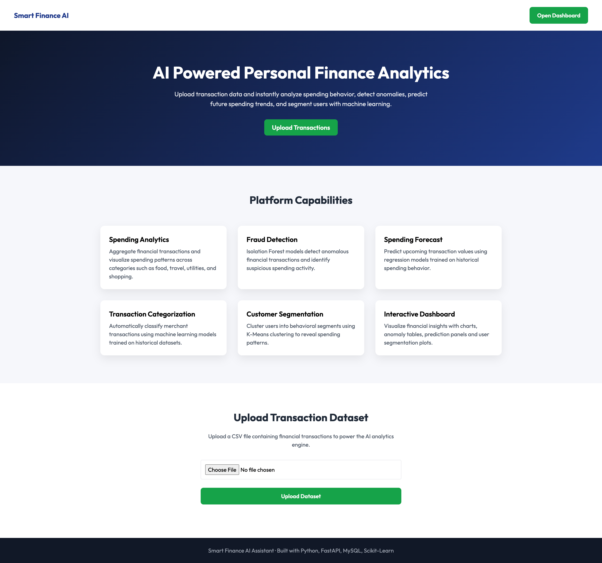
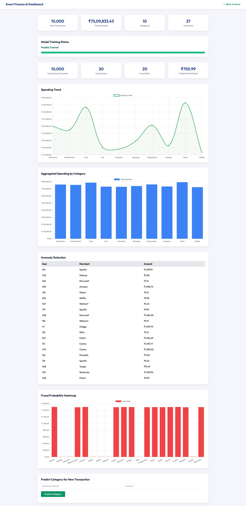

# 💰 Finance AI Assistant


A **containerized machine learning powered personal finance analytics platform** built using Python.

The system ingests large financial transaction datasets and applies machine learning to perform:

- Transaction categorization
- Fraud detection
- Spending prediction
- Customer segmentation

Everything runs locally using **Docker**, including the database, API, ML models, and frontend dashboard.

---

# 🚀 Features

## 📥 Transaction Ingestion
- Upload large CSV datasets
- Store transactions in PostgreSQL
- Handle **100k+ transaction datasets**
- Simple landing page for uploading datasets

## 🤖 Machine Learning Models

| Model | Purpose |
|------|------|
| Logistic Regression | Transaction categorization |
| Isolation Forest | Fraud detection |
| Linear Regression | Spending prediction |
| KMeans | Customer segmentation |

## 📊 Analytics APIs

```
GET /analytics/spending
GET /analytics/fraud
GET /analytics/predict
GET /analytics/cluster
GET /analytics/predict-category
```

## 🖥 Web Interface

Modern fintech-style UI built with:

- **HTML**
- **TailwindCSS**
- **jQuery**
- **Chart.js**
- **Outfit Font**

Includes:

- Finance themed landing page
- Interactive analytics dashboard
- Dataset statistics panels
- Fraud detection visualizations
- Spending trend charts

---

# 📊 Dashboard Capabilities

### 📈 Dataset Statistics Panel
Displays:

- Total transactions
- Total spending
- Number of categories
- Merchant diversity

### 📉 Animated Spending Charts
Interactive charts showing:

- Category spending distribution
- Spending trend line chart
- Real-time formatted currency values (₹)

### 🚨 Fraud Detection Panel
- Table of anomalous transactions
- Fraud probability heatmap
- Isolation Forest model results

### 🔮 Spending Prediction
Displays the predicted next transaction value using regression.

### 🧠 Category Prediction
Allows users to input:

Merchant  
Amount  

The ML classifier predicts the category instantly.

### 👥 User Segmentation
Scatter plot visualization showing clusters of users based on spending behavior.

### ⚙️ Model Training Status
Dashboard shows model training progress and readiness state.

---

# 🏗 Architecture

```
Browser
   │
Frontend (HTML + Tailwind + jQuery + Chart.js)
   │
FastAPI Backend
   │
Service Layer
   │
Machine Learning Models
   │
PostgreSQL Database
   │
Redis Queue + Celery Workers
```

This architecture mimics the design used in many **modern fintech analytics platforms**.

---

# 🗂 Project Structure

```
finance-ai-assistant
│
├── docker-compose.yml
├── requirements.txt
├── README.md
├── helper.txt
├── LICENSE
│
├── data
│   ├── csv
│   └── models
│
├── docker
│   ├── web.Dockerfile
│   └── worker.Dockerfile
│
├── frontend
│   ├── index.html
│   ├── dashboard.html
│   ├── js
│   │   ├── dashboard.js
│   │   └── upload.js
│
├── images
│   ├── frontend_dashboard.png
│   └── frontend_index.png
│
├── src
│   ├── app
│   │   ├── config.py
│   │   ├── db.py
│   │   ├── main.py
│   │   ├── models.py
│   │   │
│   │   ├── api
│   │   │   ├── analytics.py
│   │   │   └── transactions.py
│   │   │
│   │   ├── finance
│   │   │   ├── anomaly_detection.py
│   │   │   ├── categorizer.py
│   │   │   ├── clustering.py
│   │   │   └── forecasting.py
│   │   │
│   │   └── services
│   │       ├── finance_service.py
│   │       └── train_category_model.py
│   │
│   └── workers
│       ├── celery_app.py
│       └── tasks.py
│
├── frontend
│   ├── index.html
│   ├── dashboard.html
│   ├── js
│   │   ├── dashboard.js
│   │   └── upload.js
│
└── data
    ├── csv
    └── models
```

---

# 🧰 Technology Stack

## Backend
- Python
- FastAPI
- SQLAlchemy
- PostgreSQL

## Machine Learning
- Pandas
- NumPy
- Scikit-Learn
- Joblib

## Infrastructure
- Docker
- Docker Compose
- Redis
- Celery

## Frontend
- HTML
- jQuery
- TailwindCSS
- Chart.js
- Outfit Font

---

# 📂 Dataset Format

Example transaction dataset format:

```
transaction_id,user_id,date,amount,merchant,category,payment_method,city,currency,is_fraud
a1,101,2024-01-01,20,Starbucks,Food,UPI,Chennai,INR,0
b2,101,2024-01-02,150,Amazon,Shopping,Credit Card,Bangalore,INR,0
```

The system can easily process **100,000+ transactions**.

---

# ⚙️ Running the Project

## 1️⃣ Install Requirements

You only need:

- Docker
- Docker Compose

---

## 2️⃣ Start the Application

```
docker compose up --build
```

---

## 3️⃣ Access the Application

Frontend

```
http://localhost:8000/frontend/index.html
```


Dashboard

```
http://localhost:8000/frontend/dashboard.html
```


API Docs

```
http://localhost:8000/docs
```

---

# 📊 Example APIs

### Stats Summary
GET /stats

### Spending Summary
GET /analytics/spending

### Fraud Detection
GET /analytics/fraud

### Spending Prediction
GET /analytics/predict

### Customer Segmentation
GET /analytics/cluster

### Category Prediction
GET /analytics/predict-category

---

# 🧠 Machine Learning Pipeline

### Transaction Categorization
Uses **TF-IDF + Logistic Regression** based on merchant names.

### Fraud Detection
Uses **Isolation Forest** for anomaly detection.

### Spending Forecasting
Uses **Linear Regression** on spending trends.

### Customer Segmentation
Uses **KMeans clustering** to group users based on spending.

---

# 🧪 Development Commands

Start system
docker compose up

Stop system
docker compose down

Rebuild containers
docker compose up --build

---

# 📈 Future Enhancements

Possible improvements include:

- Real-time transaction ingestion with Kafka
- Deep learning fraud detection models
- Model monitoring dashboards
- Streaming analytics pipelines
- Automated model retraining

---

# 📜 License

MIT License

---

# ⭐ Contributing

Pull requests are welcome!
If you would like to contribute improvements or features, feel free to fork the repository.

---

# 🧑‍💻 Author

Developed as a **machine learning + backend engineering project** demonstrating how financial data analytics systems can be built using Python and modern infrastructure tools.
