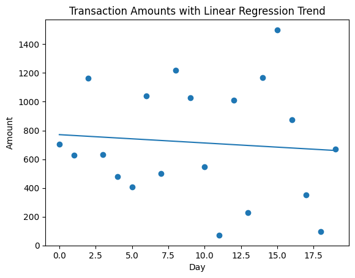

# LinearRegression _for_ Forecasting

## 🧠 Imagine This Game

You are tracking how much pocket money you spend every day 💸

```text
Day 1 → ₹10  
Day 2 → ₹12  
Day 3 → ₹14  
Day 4 → ₹16  
```

Now I ask you:

👉 “How much will you spend on Day 5?”

You might say:

👉 “Hmm… it’s increasing… maybe ₹18!”

That’s exactly what this code is doing 🤯

---

## 🎯 What This Code Does

👉 It looks at past spending
👉 Finds a pattern
👉 Predicts the next value

---

## 🧩 Let’s Break the Code (Super Simple)

---

## 1️⃣ Import Tools

```python
from sklearn.linear_model import LinearRegression
import numpy as np
```

👉 We bring a **smart guessing machine 🤖**

This machine is good at:

> “Finding patterns and drawing a straight line”

---

## 2️⃣ Function Starts

```python
def predict_spending(amounts):
```

👉 `amounts` = your spending list

Example:

```text
[10, 12, 14, 16]
```

---

## 3️⃣ Create X (Days)

```python
X = np.arange(len(amounts)).reshape(-1,1)
```

This creates:

```text
Day numbers → [0, 1, 2, 3]
```

So now we have:

| Day | Amount |
| --- | ------ |
| 0   | 10     |
| 1   | 12     |
| 2   | 14     |
| 3   | 16     |

👉 We are telling the model:

> “These amounts happened over time”

---

## 4️⃣ Create Model

```python
model = LinearRegression()
```

👉 This creates a **line-drawing robot 📏**

---

## 5️⃣ Learn Pattern

```python
model.fit(X, amounts)
```

👉 Robot looks at data and says:

> “Oh! Every day amount increases by 2!”

So it draws a line like:

```text
Amount = Day * 2 + 10
```

---

## 📈 Visual Idea

```
Amount ↑

16 |        ●
14 |     ●
12 |   ●
10 | ●
   +----------------
     0  1  2  3   → Day
```

👉 The robot draws a **straight line through these points**

---

## 6️⃣ Predict Next Value

```python
pred = model.predict([[len(amounts)+1]])
```

Let’s calculate:

```python
len(amounts) = 4
```

So:

```python
predict for day = 5
```

👉 Robot says:

```text
Day 5 → ₹18
```

---

## 7️⃣ Return Answer

```python
return float(pred[0])
```

👉 Return prediction as a number

---

## 🎯 Final Output

Input:

```text
[10, 12, 14, 16]
```

Output:

```text
18
```

---

## 🧠 Simple Summary

👉 The code is doing this:

> “Look at past numbers, find the pattern, and guess the next number”

---

## 🎮 Real-Life Examples

### 📈 Pocket money

₹10 → ₹12 → ₹14 → ₹16
👉 Next → ₹18

---

### 💸 Spending

₹100 → ₹150 → ₹200 → ₹250
👉 Next → ₹300

---

## ⚠️ Important Note (Very Important)

This only works well when data is **smooth and increasing/decreasing**

If data is random:

```text
10, 200, 5, 300
```

👉 Prediction will be weird 😅

---

## 🧠 In Your Project

This helps:

* predict next expense 💸
* show trend 📈
* estimate future spending

---

## 🎯 One-Line Understanding

👉 “Draw a straight line through past data and extend it forward.”

---

If you want next level, I can show:

👉 how the line equation is calculated (very simple math)
👉 or visualize your real transaction data with a line graph 📊

---

## Understanding the concept using below amounts array: 

```
[702.52, 629.85, 1162.21, 632.59, 479.81, 405.28, 1039.28, 501.88, 1220.87, 1027.22, 547.28, 71.19, 1008.54, 227.39, 1169.86, 1499.91, 875.23, 351.37, 95.41, 668.66]
```

---

## 🧠 Big Idea

We want to draw **one straight line** that best fits all your points.

👉 Like placing a ruler over messy dots and saying
“this is the *average direction*”

---

## 🎯 Step 1 — Make X (Days)

We convert your data into:

| Day (X) | Amount (Y) |
| ------- | ---------- |
| 0       | 702.52     |
| 1       | 629.85     |
| 2       | 1162.21    |
| ...     | ...        |
| 19      | 668.66     |

👉 So:

```text
X = 0, 1, 2, ..., 19
Y = your amounts
```

---

## 🎯 Step 2 — The Line Formula

The model tries to find a line like:

```text
Y = mX + b
```

Where:

* **m** = slope (how fast it increases/decreases)
* **b** = starting value

---

## 🎯 Step 3 — Calculate the “Average Point”

First, find the **center of all points**:

### Average X:

```text
X̄ = (0 + 1 + ... + 19) / 20 = 9.5
```

### Average Y:

Let’s approximate your average:

```text
Ȳ ≈ 726
```

👉 So center point is:

```text
(9.5, 726)
```

---

## 🎯 Step 4 — Find Slope (m)

We use this idea:

```text
m = how much Y changes when X changes
```

Instead of exact formula, think like this:

---

## Pick 2 far-apart points (simple trick)

Take:

```text
Start → (0, 702)
End   → (19, 668)
```

Now:

```text
change in Y = 668 - 702 = -34
change in X = 19 - 0 = 19
```

So:

```text
m ≈ -34 / 19 ≈ -1.8
```

👉 Means:

> “Spending slightly decreases over time”

---

## 🎯 Step 5 — Find Intercept (b)

We use:

```text
b = Ȳ - mX̄
```

Substitute:

```text
b = 726 - (-1.8 × 9.5)
```

```text
b ≈ 726 + 17.1 ≈ 743
```

---

## ✅ Final Line Equation

```text
Y = -1.8X + 743
```

---

## 🎯 Step 6 — Predict Next Value

Next day = X = 20

```text
Y = -1.8 × 20 + 743
Y = -36 + 743
Y ≈ 707
```

---

## 🎉 Final Prediction

👉 **Next spending ≈ ₹707**

---

## 📊 What This Means

Even though your data is messy:

* some high values (₹1500)
* some low values (₹71)

👉 The model finds the **overall trend**

And says:

> “On average, spending is slightly going down”

---

## 🎮 Simple Analogy

Imagine:

* You throw a ball many times 🎾
* It goes up and down randomly

But overall:

👉 It slowly comes down

That’s what the line captures.

---

## 🧠 Important Insight

Your data is **very noisy** (up and down)

So:

👉 Line is just a **rough guess**, not perfect

---

## 🎯 One-Line Summary

👉 “Linear Regression finds the best straight line that passes through the middle of all points.”

---

## Plotting your actual data + regression line 📈



---

## 🧠 How to Read This Plot

### 🔵 Dots (scatter points)

Each dot = one transaction

* X-axis → Day (time)
* Y-axis → Amount (₹)

👉 These are your **real data points** (very messy, up & down)

---

### 📏 Line (regression line)

This is the **best-fit straight line**

👉 It represents the **overall trend**

---

## 🎯 What Your Data Is Saying

Look at the line:

👉 It is slightly going **downwards**

That means:

> “On average, your spending is slightly decreasing over time”

---

## ⚠️ Important Observation

Your data is **very noisy**:

* Some values are very high (₹1500)
* Some are very low (₹71)

So:

👉 The line ignores noise and finds the **average direction**

---

## 💡 Intuition (Super Important)

Think of it like this:

* Dots = real life (messy)
* Line = overall story

---

## 🎮 Simple Analogy

Imagine:

You are walking up and down stairs randomly 🧍

But overall:

👉 You are slowly going downstairs

That’s what the line shows.

---

## 🔥 How This Helps Your Project

You can now:

### 1️⃣ Show trend in dashboard

```text
"Spending trend: decreasing 📉"
```

---

### 2️⃣ Predict next value

Use:

```python
model.predict([[next_day]])
```

---

### 3️⃣ Add visualization in UI

Use:

* Chart.js line chart
* Show:

  * actual data (dots)
  * trend line

---

## 🧠 Pro Insight (for interviews)

You can say:

> “We use Linear Regression to capture the overall spending trend, smoothing out noise and predicting future values.”

---
